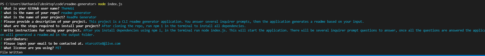
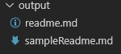

 # ReadMe Generator

 ## Table of Contents
* [Installation](#installation)
* [Instructions](#instructions)
* [Contributors](#contributors)
* [Questions](#questions)
* [License](#license)

## Description:
The purpose of this project was to create a CLI application that can take in user input, and use it to generate a `readme.md`. When you run the script it will run an inquirer prompt that will ask you a series of questions. Using your input from these questions a readme will be generated.

## Installation
After cloning the repo, run `npm i` in your terminal, that will install all dependencies for the script.

## Instructions
1. Clone the repo
2. Run `npm i` in your terminal to install dependencies
3. Run `node index.js` to start the application
4. Answer the inquirer prompt questions
5. Navigate to the output folder to find your generated `readme.md`

## Quesions
If you have any questions, contact me <a href="https://github.com/TheHebi" target="_blank">here</a>, or send me an email at nturcotte8@live.com.

## License 
 This project uses the MIT License
